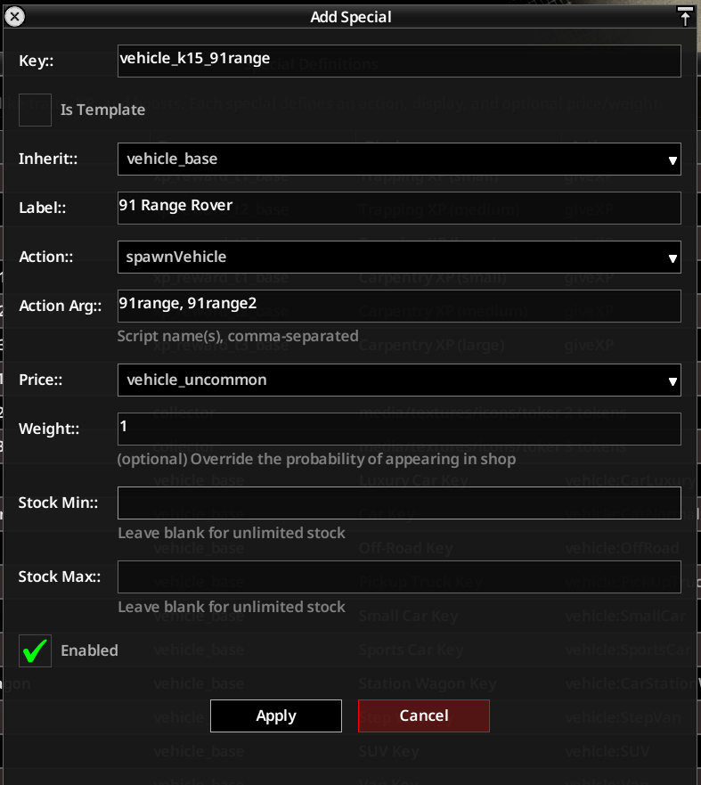
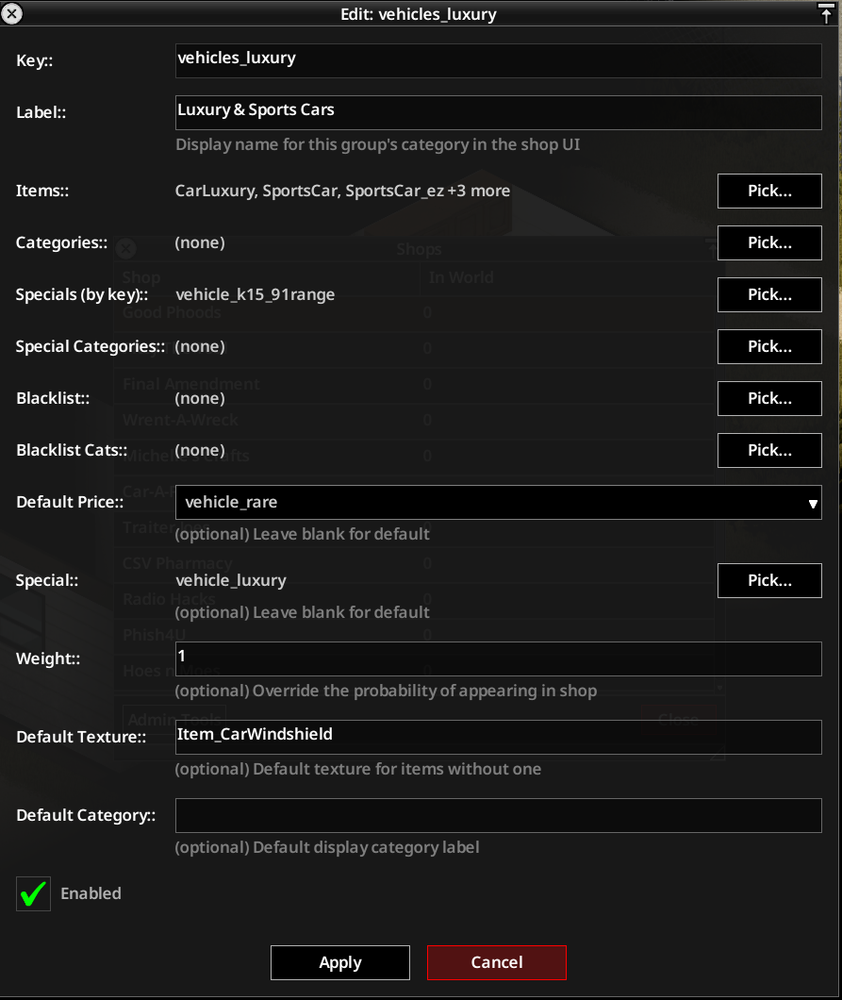

# Adding a Modded Vehicle to WrentAWreck

---

Vehicles are different to normal items. Each vehicle has a unique script id that we need to wrap into a PhunMart "special" so PhunMart knows how to sell it

## Quick start

Most vehicle mods list their script IDs on their Steam Workshop page. That's all you need.

This example uses the [91 Range Rover mod](https://steamcommunity.com/sharedfiles/filedetails/?id=2409333430),
which lists script names `91range` and `91range2`.

### 1. Create a Special

Open the **Admin Tools > Specials** editor and add a new entry:



| Field       | Value                                                                           |
| ----------- | ------------------------------------------------------------------------------- |
| Key         | something unique, e.g. `vehicle_k15_91range`                                    |
| Inherit     | `vehicle_base`                                                                  |
| Label       | Display name shown on the claim key                                             |
| Action      | `spawnVehicle`                                                                  |
| Action Args | Comma-separated script names from the mod page, e.g. `91range, 91range2`        |
| Price       | `vehicle_common`, `vehicle_uncommon`, or `vehicle_rare` (see price tiers below) |

Leave Stock Min/Max blank for unlimited stock.

### 2. Add the Special to a Group

Open **Admin Tools > Groups**, find the group that fits the vehicle tier
(e.g. `vehicles_luxury` for high-end vehicles), and add your special key to **Specials (By key)**:



Apply and restart/reload. The vehicle will now appear in WrentAWreck.

---

## What this approach gives you (and what it trades off)

Putting all script names into one special's Action Args creates **one offer row** in the shop.
When a player buys it, the game picks a random script from your list -- they cannot select a
specific variant.

This is fine for a set of near-identical variants (e.g. colour swaps). If you want players to
be able to pick a specific vehicle (e.g. "I want the Rover, not the Defender"), use the
[per-vehicle approach](#per-vehicle-rows) below.

---

## Price tiers

| Price key          | Token range | Typical use                    |
| ------------------ | ----------- | ------------------------------ |
| `vehicle_common`   | 10–20 gold  | Small/economy cars, basic vans |
| `vehicle_uncommon` | 20–40 gold  | Normal cars, trucks, SUVs      |
| `vehicle_rare`     | 40–80 gold  | Luxury / sports / rare         |

---

## Per-vehicle rows

If you want a separate selectable row for each variant, the player picks the exact vehicle
from the shop list and gets that specific one -- `offer.item` carries the script name through
to the spawn logic.

You have two routes:

**Route A -- Admin UI (repeat the quick-start once per variant)**

Follow steps 1 and 2 from the quick start, but create one special per script name, each
with a single entry in Action Args. Then add all the resulting special keys to the group's
**Specials (By key)** field. As many variants as you have, that many times through the flow.

**Route B -- Edit `PhunMart_Specials.lua` directly**

Create the file `Zomboid/Lua/PhunMart_Specials.lua` (or add to it if it already exists) and
define one entry per variant:

```lua
return {
    vehicle_91range_a = {
        inherit = "vehicle_base",
        price = "vehicle_rare",
        offer = { weight = 1.0, stock = { min = 1, max = 1 } },
        display = { text = "91 Range Rover (Sand)" },
        actions = {{ type = "spawnVehicle", scripts = {"91range"}, args = {
            condition = { min = 85, max = 100 }, fuel = { min = 0.3, max = 0.7 }
        }}}
    },
    vehicle_91range_b = {
        inherit = "vehicle_base",
        price = "vehicle_rare",
        offer = { weight = 1.0, stock = { min = 1, max = 1 } },
        display = { text = "91 Range Rover (Green)" },
        actions = {{ type = "spawnVehicle", scripts = {"91range2"}, args = {
            condition = { min = 85, max = 100 }, fuel = { min = 0.3, max = 0.7 }
        }}}
    },
}
```

Then add both keys to the group via the admin Groups editor (**Specials (By key)**), or in
`PhunMart_Groups.lua`:

```lua
return {
    vehicles_luxury = {
        specials = {"vehicle_91range_a", "vehicle_91range_b"},
    },
}
```

See [Specials](CUSTOMISATION.md#5-specials) and [Groups](CUSTOMISATION.md#8-groups) in the
customisation guide for the full field reference.

---

## How to find script names

1. Subscribe to the mod on Steam Workshop.
2. Check the mod's description page -- most vehicle mods list their script IDs.
3. If not listed, find the mod folder under `Steam/steamapps/workshop/content/108600/<id>/`
   and open any `.txt` file under `media/scripts/vehicles/`. Each vehicle block starts with:
   ```
   vehicle <ScriptName>
   {
   ```
   The `<ScriptName>` is what you enter in Action Args.

Script names are **case-sensitive**.

---

## If the vehicle mod is removed (or a script name is wrong)

The purchase will still complete -- currency is deducted and the player receives a
`Vehicle Claim Key` item in their inventory. PhunMart stores the script name as a string;
it has no way to validate that the mod is still active at purchase time.

When the player right-clicks the key and chooses **Claim**, the game tries to spawn a vehicle
using that script name. If the mod is gone (or the name was wrong), the game returns nothing
and the spawn silently fails:

- No vehicle appears
- No error is shown to the player
- **The key is not consumed** -- it stays in inventory permanently

The player is effectively left with a useless item and has already paid. There is no automatic
refund.

**To avoid this:**
- Only add a vehicle mod's scripts while that mod is active on the server
- If you remove a vehicle mod, remove the corresponding special and group entries at the same
  time so the offer stops appearing at restock
- Existing held keys become dead items if the mod is removed mid-session; affected players
  would need manual compensation (return their currency via admin tools)

---

## How the spawn works (for reference)

When a player buys a vehicle offer:

1. The server picks the vehicle script (either the exact one the player selected, or a random
   one from the special's `scripts` list).
2. A `VehicleKeySpawner` item is added to the player's inventory, tagged with the script name
   in ModData, and named `"Vehicle Claim Key: <label>"`.
3. The client receives a `spawnVehicle` command so the key knows which vehicle to summon when
   used in the world.

---

## File reference

| What                   | File                                                   |
| ---------------------- | ------------------------------------------------------ |
| Price tiers            | `defaults/prices.lua`                                  |
| Special definitions    | `defaults/specials.lua` (VEHICLES section)             |
| Group definitions      | `defaults/groups.lua` (WrentAWreck section)            |
| Pool→group wiring      | `defaults/pools.lua`                                   |
| Shop→pool wiring       | `defaults/shops.lua` (`WrentAWreck.poolSets`)          |
| Spawn logic (server)   | `server/PhunMart_Server/main.lua` (`grantReward`)      |
| Key use logic (client) | `client/PhunMart_Client/commands.lua` (`spawnVehicle`) |
