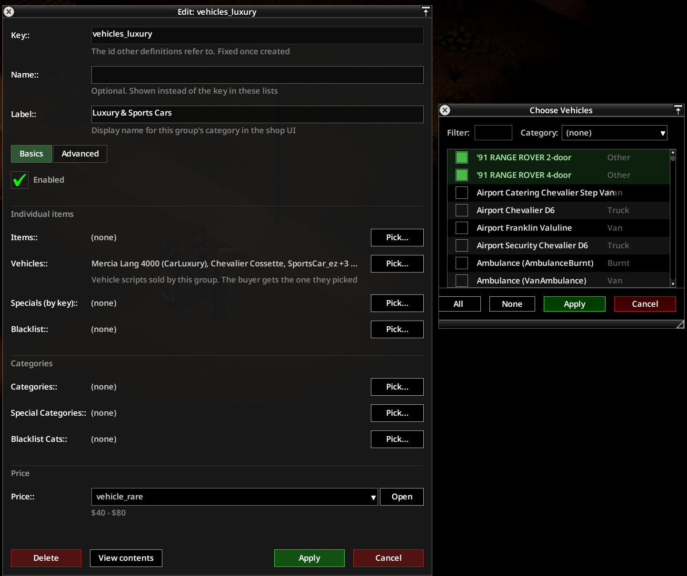
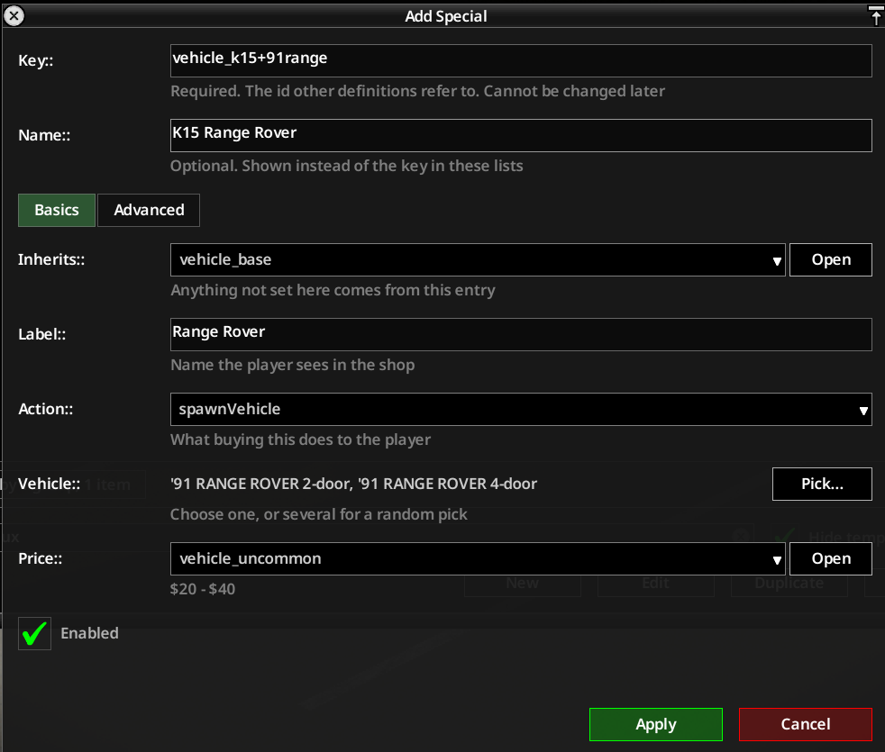

# Adding a Modded Vehicle to WrentAWreck

Vehicles are not inventory items. Each one is a script id in the game's vehicle database, and
PhunMart needs to know that a given id is something WrentAWreck may sell. That is all this
guide is about.

---

## Quick start

If the vehicle mod is loaded, its cars are already in PhunMart's vehicle picker. You do not
need script names, and you do not need to create anything.

1. Open the Admin Panel and click `** PhunMart **`, then go to the **Groups** tab.
2. Pick the group matching the tier you want the vehicle to sell at, for example
   `vehicles_luxury` for high-end cars, and click **Edit**.
3. Click **Pick...** next to **Vehicles**, find the vehicle by name, tick it, and confirm.
4. **Apply**.



That is the whole job. The vehicle appears in WrentAWreck as its own row at the next restock,
priced and rewarded by the group's defaults. Use **Restock every machine** on the Tools tab if
you do not want to wait.

### Which group

Each group carries the price tier and the spawn behaviour, so choosing the group is how you
choose what the car costs.

| Group              | Label             | Price tier         | Cost          |
| ------------------ | ----------------- | ------------------ | ------------- |
| `vehicles_small`   | Small Cars        | `vehicle_common`   | $10.00-$20.00 |
| `vehicles_vans`    | Vans & Pickups    | `vehicle_common`   | $10.00-$20.00 |
| `vehicles_normal`  | Cars & Sedans     | `vehicle_uncommon` | $20.00-$40.00 |
| `vehicles_trucks`  | Pickup Trucks     | `vehicle_uncommon` | $20.00-$40.00 |
| `vehicles_4x4`     | Off-Road & SUVs   | `vehicle_uncommon` | $20.00-$40.00 |
| `vehicles_luxury`  | Luxury & Sports   | `vehicle_rare`     | $40.00-$80.00 |

Prices are in **change**, the wallet currency, and each is a range rolled fresh per restock. If
you have switched the mod to item-based currency, these scale with the rest of the tree.

**The tier also decides where the car can be sold.** WrentAWreck has one pool per tier, and
each is zone-gated when [PhunZones](https://github.com/PhunZoider/PhunZones) is installed:
small and van groups appear in difficulty 0 to 2, the uncommon groups in 2 to 3, and luxury in
4 only. Put a car in `vehicles_luxury` and it will only ever show up at machines standing in
the roughest zones. Without PhunZones every pool is eligible everywhere.

---

## Why this works

A group normally turns each entry in `items` into an offer that hands over that item. The
vehicle groups set `defaults.reward` to a `spawnVehicle` special instead, so every entry
becomes a car offer, and the entry the player bought is the car they get.

```json
"vehicles_luxury": {
  "label": "Luxury & Sports Cars",
  "defaults": {
    "price": "vehicle_rare",
    "reward": "vehicle_luxury",
    "offer": { "weight": 1.0 }
  },
  "items": ["CarLuxury", "SportsCar", "SportsCar_ez",
            "RaceCar12", "RaceCar34", "RaceCar58"]
}
```

`defaults.reward` is the one special shared by every entry, and your car joins the `items`
list alongside the shipped ones.

So one special serves the whole tier, each car is its own selectable row, and adding a car is
one name in a list. There is no reason to create a special of your own unless you want that
particular car to behave differently from its tier.

Equivalent by hand, in `PhunMart_Groups.json`:

```json
{
  "vehicles_luxury": {
    "items": ["CarLuxury", "SportsCar", "SportsCar_ez",
              "RaceCar12", "RaceCar34", "RaceCar58",
              "91range", "91range2"]
  }
}
```

Note that `items` is an array, and arrays are replaced whole rather than merged, so the shipped
entries have to be repeated alongside yours or they disappear. The admin UI handles that for
you, which is the main reason to prefer it.

---

## When you do need a special

Create one when the vehicle should differ from its tier: a different price, limited stock, a
custom label, or specific condition and fuel ranges.

Open the **Specials** tab and add an entry:

| Field           | Value                                                              |
| --------------- | ------------------------------------------------------------------ |
| Name            | What admins see in the list, for example `91 Range Rover`          |
| Key             | Something unique, for example `vehicle_k15_91range`                |
| Inherit         | `vehicle_base`                                                     |
| Label           | The name shown on the claim key and in the shop                    |
| Action          | `spawnVehicle`                                                     |
| Vehicle Scripts | **Pick...**, then tick the variants this offer may spawn           |

Price, weight and stock are on the **Advanced** tab. Leave stock blank for unlimited.



Then add the key to a group's **Specials (by key)** field, the same way as above but in the
other picker.

**One special, many scripts, one row.** If you tick several variants in Vehicle Scripts, they
become a single shop row and the game picks one at random when it is bought. That is right for
colour swaps of the same car and wrong when players should be able to choose, in which case
make one special per variant, or use the `items` route above, which gives separate rows for
free.

By hand, in `PhunMart_Specials.json`:

```json
{
  "vehicle_91range_a": {
    "inherit": "vehicle_base",
    "price": "vehicle_rare",
    "offer": { "weight": 1.0, "stock": { "min": 1, "max": 1 } },
    "display": { "text": "91 Range Rover (Sand)" },
    "actions": [{
      "type": "spawnVehicle",
      "scripts": ["91range"],
      "args": {
        "condition": { "min": 85, "max": 100 },
        "fuel": { "min": 0.3, "max": 0.7 }
      }
    }]
  }
}
```

See [Specials](CUSTOMISATION.md#5-specials) and [Groups](CUSTOMISATION.md#8-groups) for the
full field reference.

---

## Finding script names by hand

You should not need these, since the picker lists everything the game has loaded and shows
proper names. If you are writing config on a machine without the mod installed:

1. Most vehicle mods list their script ids on the Steam Workshop page.
2. Otherwise, open any `.txt` under `media/scripts/vehicles/` in the mod folder
   (`Steam/steamapps/workshop/content/108600/<id>/`). Each vehicle block starts:
   ```
   vehicle <ScriptName>
   {
   ```
3. `/dumppz vehicles` writes every script the server currently knows about to a Lua file.

Script names are **case-sensitive**. A name that does not resolve is dropped at compile time
with a warning in the server log, so a typo means the car silently never appears.

---

## If the vehicle mod is removed

PhunMart checks script names twice, at compile time and again when the purchase resolves, so an
offer for a car that no longer exists stops appearing once the mod is gone. Keys already in
someone's inventory are the problem.

A **Vehicle Claim Key** stores its script name in ModData. When the player right-clicks and
chooses Claim, the game tries to spawn that script. If it is gone:

- No vehicle appears
- No error is shown to the player
- **The key is not consumed**, so it sits in their inventory forever

They have paid and received nothing, and there is no automatic refund.

To avoid it:

- Only add a mod's scripts while that mod is active on the server
- Remove the corresponding group entries at the same time you remove the mod, so the offer
  stops appearing at the next restock
- Compensate anyone holding a dead key by hand, using the **Wallets** tab

---

## How the spawn works

1. The server picks the script: the exact one the player selected when the offer carried it,
   otherwise a random valid one from the special's list.
2. A `VehicleKeySpawner` item goes into the player's inventory, tagged with the script name and
   the rolled condition, and named `Vehicle Claim Key: <label>`.
3. Using the key outdoors spawns the vehicle.

Livestock at HoesNMoes works the same way, with an `AnimalClaimToken` and a `spawnAnimal`
action. See [special kinds](CUSTOMISATION.md#14-reference-special-kinds).

---

## File reference

| What                   | File                                                   |
| ---------------------- | ------------------------------------------------------ |
| Price tiers            | `defaults/prices.lua`                                  |
| Special definitions    | `defaults/specials.lua` (VEHICLES section)             |
| Group definitions      | `defaults/groups.lua` (WrentAWreck section)            |
| Pool to group wiring   | `defaults/pools.lua`                                   |
| Shop to pool wiring    | `defaults/shops.lua` (`WrentAWreck.poolSets`)          |
| Spawn logic (server)   | `server/PhunMart_Server/main.lua` (`grantReward`)      |
| Key use logic (client) | `client/PhunMart_Client/commands.lua` (`spawnVehicle`) |

All are under `Contents/mods/PhunMart2/common/media/lua/shared/PhunMart/`, except the last two,
which are under `.../media/lua/`.
