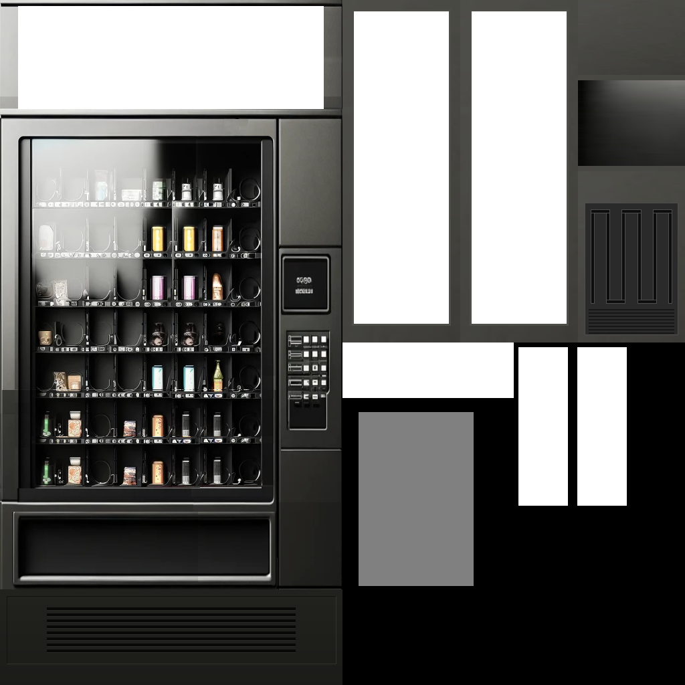

# PhunMart: Machine Art Reference

Every machine is drawn as the same 3D vending machine, wearing its shop's **texture**. That one
picture is the whole look of a shop: the machine in the world, and the front of it doubles as
the shop window. PhunMart ships more textures than its default shops use, so a new shop can
look like a real machine without anyone having to draw one.

Under the model there are still 2D **tiles**. They decide which way the machine faces and make
the square solid, and they are what a player sees if they turn 3D machines off. A shop can
name tiles of its own, or leave them out and stand on the generic machine.

For how a shop uses these fields, see [Shops](CUSTOMISATION.md#10-shops) in the customisation
guide. For a shop added from another mod, see [A machine of your own](GUIDE_EXTENDING.md#a-machine-of-your-own).

---

## Table of Contents

- [Textures](#textures)
- [Spare textures](#spare-textures)
- [Making a texture](#making-a-texture)
- [The shop window](#the-shop-window)
- [2D tiles](#2d-tiles)
- [Art already in use](#art-already-in-use)
- [Player options](#player-options)
- [Using PhunMart's art from another mod](#using-phunmarts-art-from-another-mod)

---

## Textures

Textures live in `media/textures/phunmart/`. A shop names one by file name, without the folder
or the extension:

```json
"texture": "zetsy"
```

That reads `media/textures/phunmart/zetsy.png`. A name with a slash in it is read from
`media/textures/` instead (`"mymod/machine"`), and one starting `media/` is used as it stands.

If the file is missing, the server log says so and the machine falls back to its 2D tiles. The
shop editor checks the name as you type it, so a typo shows up there first.

A shop that names no `texture` but does name a `background` of the old form,
`machine-<name>.png`, wears `phunmart/<name>` if that file exists. That is only there so older
definitions keep their look; new ones should name the texture.

---

## Spare textures

None of the default shops wear these. Each was made from the matching old window art, so the
banners still say the names they were drawn for. That is only a hint: a shop can put any stock
behind any texture.

| Texture       | Drawn for              |
| ------------- | ---------------------- |
| `phat-phoods` | PhatPhoods             |
| `gifted-xp`   | GiftedXPerience        |
| `luxury-xp`   | LuxuryXPerience        |
| `travellers`  | Travellers             |
| `zetsy`       | Zetsy                  |
| `lootgoblin`  | LootGoblin             |
| `necromart`   | NecroMart              |
| `none`        | A plain machine with a blank sign. The shop window falls back to its front when a shop has no texture at all. |
| `broken`      | The same machine with its glass and sign smashed and the shelves almost empty. |

The **3D texture** list in the **Create a shop** wizard and the shop editor offers every
texture a shop already wears plus all of these, with a 3D preview you can drag to turn. Pick
**Other** to type a name the list does not have.

---

## Making a texture

A texture is a **1024 x 1024** PNG wrapped around the model. It has two parts:

- **Colour**: everything outside the bottom-right 512 x 512 block. Each face of the machine has
  its own region, painted as if looking straight at it from outside.
- **Glow mask**: the bottom-right 512 x 512 block is the whole texture again at half size, in
  greys. White is lit when the machine is powered, black is not, grey is in between. The
  shipped textures light the banner and side panels fully and the glass by half.

| Region | Pixels (x, y to x, y) | Notes                                                       |
| ------ | --------------------- | ----------------------------------------------------------- |
| Front  | 0, 0 to 512, 1024     | Banner at the top. Also the shop window, so it gets the most room |
| Left   | 512, 0 to 688, 512    | Seen from the machine's left: back edge on the left          |
| Right  | 688, 0 to 864, 512    | Front edge on the left, back on the right                    |
| Top    | 864, 0 to 1024, 112   | Seen from above, back edge at the top                        |
| Trim   | 864, 120 to 1024, 248 | Plain dark finish for the recess walls                        |
| Back   | 864, 256 to 1024, 512 | Small: it is nearly always against a wall                     |

On the front, the banner is rows 0 to 166, the recessed glass is 47, 209 to 392, 729, and the
pickup tray is 27, 771 to 404, 863. Keep those where they are: the model is cut to them and the
shop window draws its controls over them.

Keep it a power of two. The engine pads other sizes, and the glow shaders assume it has not.

### The easy way: an overlay

[Tools/blender/vending_overlay.png](../Tools/blender/vending_overlay.png) is a finished machine,
glow mask included, with its three ad spaces cut out to transparency. Download it and, in GIMP,
Photoshop, Krita or anything else with layers:

1. Open it, and add a new layer **underneath** it.
2. Paint or paste your art on that lower layer, filling the holes. The overlay hides anything
   that spills outside them.
3. Export the image as a PNG, which flattens the two together. That is your texture.

<p>
  
</p>

| Hole        | Pixels (x, y to x, y) | Size      | Seen                                     |
| ----------- | --------------------- | --------- | ---------------------------------------- |
| Banner      | 27, 9 to 484, 163     | 457 x 154 | Across the top of the front, and in the shop window |
| Left panel  | 529, 17 to 671, 484   | 142 x 467 | Down the machine's left side             |
| Right panel | 705, 17 to 847, 484   | 142 x 467 | Down the machine's right side            |

Paint the side panels upright, as you would see them standing beside the machine. The left
panel's left edge is towards the back of the machine; the right panel's left edge is towards
the front.

The glow mask (bottom right) already lights the banner and both side panels, so they glow when
the machine has power. Leave it alone unless you want a different glow.

### Tools

The tools that build the shipped textures are in the repository under
[Tools/blender](../Tools/blender), and run in Blender from the command line:

- **Converting old window art.** If you have a `machine-<name>.png` drawn for the old shop
  window, this builds a texture from it, banner and all:
  ```
  blender -b --factory-startup --python Tools/blender/make_wrap_textures.py -- --convert machine-mine.png mine.png
  ```
- **Painting from scratch.** `Tools/blender/vending_template.png` has every region in its own
  colour with the glow areas outlined. Paint over it, or over any shipped texture.
- **Rebuilding the overlay**, after a change to the layout:
  ```
  blender -b --factory-startup --python Tools/blender/make_wrap_textures.py -- --overlay
  ```

Ship the result in your mod's own `media/textures/phunmart/`. Mod textures folders merge, so it
is found by name like the shipped ones.

---

## The shop window

The window is the front of the texture, drawn at its own proportions, with the item grid on the
glass, the keypad beside it and the details in the tray. A shop needs nothing else.

A shop can still name a `background`: an image under `media/textures/`, drawn over the whole
window instead of the texture's front. It is an override, for a window that should not look
like the machine. Draw it at **1 : 2** (512 x 1024 or a multiple) and keep the glass, keypad
and tray where [front_base.png](../Tools/blender/front_base.png) has them, or the controls will
not sit on the art.

The old `machine-*.png` images are still shipped, but they were drawn for the previous window's
shape (537 x 731). They are the source the textures were made from, not backgrounds to use: as
a `background` they would be stretched and the controls would miss them.

---

## 2D tiles

PhunMart's tiles live in three sheets, `phunmart_01`, `phunmart_02` and `phunmart_03`, each
8 x 8, so tiles are numbered `0` to `63`. You can see the sheets themselves in
[images/phunmart_01.png](images/phunmart_01.png), [images/phunmart_02.png](images/phunmart_02.png)
and [images/phunmart_03.png](images/phunmart_03.png).

Every machine is a block of eight tiles in a row:

| Offset | Used for                 | Facing |
| ------ | ------------------------ | ------ |
| `+0`   | `sprites[1]`             | East   |
| `+1`   | `sprites[2]`             | South  |
| `+2`   | `sprites[3]`             | West   |
| `+3`   | `sprites[4]`             | North  |
| `+4`   | `unpoweredSprites[1]`    | East   |
| `+5`   | `unpoweredSprites[2]`    | South  |
| `+6`   | `unpoweredSprites[3]`    | West   |
| `+7`   | `unpoweredSprites[4]`    | North  |

The order is East, South, West, North, not the compass order you might expect. The unpowered
tiles are only drawn when the shop sets `"powered": true` and the power is off.

### The generic machine

A shop that names no `sprites` stands on the generic machine, `phunmart_01_0` to `_7`, a plain
vending machine with no shop's name on it. Any number of shops can share it: the machine
remembers which shop it is, even when a player picks it up and puts it down somewhere else.
This is the simplest choice for a new shop, since its look comes from the texture anyway.

### Spare tile blocks

None of the default shops use these. They all work as machines: the tile properties (vending
machine, movable, solid, scrap) are already set.

| First tile       | Full range                | Tile name         | Matching texture | In the wizard        |
| ---------------- | ------------------------- | ----------------- | ---------------- | -------------------- |
| `phunmart_01_0`  | `phunmart_01_0` to `_7`   | Vending (generic) | `none`           | Generic machine      |
| `phunmart_01_16` | `phunmart_01_16` to `_23` | PhatPhoods        | `phat-phoods`    | Unused machine art 2 |
| `phunmart_02_48` | `phunmart_02_48` to `_55` | GiftedXPerience   | `gifted-xp`      | Unused machine art 3 |
| `phunmart_02_56` | `phunmart_02_56` to `_63` | LuxuryXPerience   | `luxury-xp`      | Unused machine art 4 |
| `phunmart_03_16` | `phunmart_03_16` to `_23` | Travellers        | `travellers`     | Unused machine art 5 |
| `phunmart_03_40` | `phunmart_03_40` to `_47` | Zetsy             | `zetsy`          | Unused machine art 6 |
| `phunmart_03_48` | `phunmart_03_48` to `_55` | LootGoblin        | `lootgoblin`     | Unused machine art 7 |
| `phunmart_03_56` | `phunmart_03_56` to `_63` | NecroMart         | `necromart`      | Unused machine art 8 |

"Tile name" is the `CustomName` in the tile definitions, which is the name the game shows for
the object. The wizard offers these blocks under **Machine** on its Appearance step, followed by
every existing shop's tiles if you would rather copy one.

Avoid giving two shops the same *themed* block. On its own tiles a machine can still be told
apart by what it remembers, but a machine placed from that block's item in the Items List would
become whichever shop the tile was named for. Shops that share should share the generic block.

---

## Art already in use

| Shop                | Texture               | Tiles start at   |
| ------------------- | --------------------- | ---------------- |
| `GoodPhoods`        | `good-phoods`         | `phunmart_01_8`  |
| `PittyTheTool`      | `pity-the-tool`       | `phunmart_01_24` |
| `FinalAmendment`    | `final-amendment`     | `phunmart_01_32` |
| `WrentAWreck`       | `wrent-a-wreck`       | `phunmart_01_40` |
| `MichellesCrafts`   | `michelles`           | `phunmart_01_48` |
| `CarAParts`         | `car-a-part`          | `phunmart_01_56` |
| `TraiterJoes`       | `traiter-joes`        | `phunmart_02_0`  |
| `CSVPharmacy`       | `csv`                 | `phunmart_02_8`  |
| `RadioHacks`        | `electronics`         | `phunmart_02_16` |
| `Phish4U`           | `phish4u`             | `phunmart_02_24` |
| `HoesNMoes`         | `hoes`                | `phunmart_02_32` |
| `BudgetXPerience`   | `budget-xp`           | `phunmart_02_40` |
| `HardWear`          | `hard-wear`           | `phunmart_03_0`  |
| `Collectors`        | `collectors`          | `phunmart_03_8`  |
| `ShedsAndCommoners` | `sheds-and-commoners` | `phunmart_03_24` |
| `PrawnStars`        | `prawn-stars`         | `phunmart_03_32` |

---

## Player options

Under **Options > Mods > PhunMart**, each player chooses for themselves:

| Option                       | Default | What it does                                                                     |
| ---------------------------- | ------- | -------------------------------------------------------------------------------- |
| 3D vending machines          | On      | Off shows the 2D tiles instead.                                                  |
| Full-detail vending machines | On      | Draws 3D machines sharp all the time rather than the game's cached view. Turn off to save a little performance with many machines on screen. |

The glow mask follows the machine's power: full brightness when it needs power and has it,
softer when it needs none, and dimmed and greyed when it needs power and has none. The light a
machine casts on the ground is separate, set by the shop's `light` field.

---

## Using PhunMart's art from another mod

Sprite names are global once a tile pack loads, and textures folders merge, so another mod
*can* point a shop at `phunmart_03_16` or `"texture": "zetsy"` and it will draw. For tiles it is
better to ship your own pack, or to use the generic block: otherwise your machine's art comes
from a repository you do not own, and the two mods have to be versioned together whenever a
sprite changes. See [A machine of your own](GUIDE_EXTENDING.md#a-machine-of-your-own).

Textures are easier: ship your own in your mod's `media/textures/phunmart/`, no pack needed.
