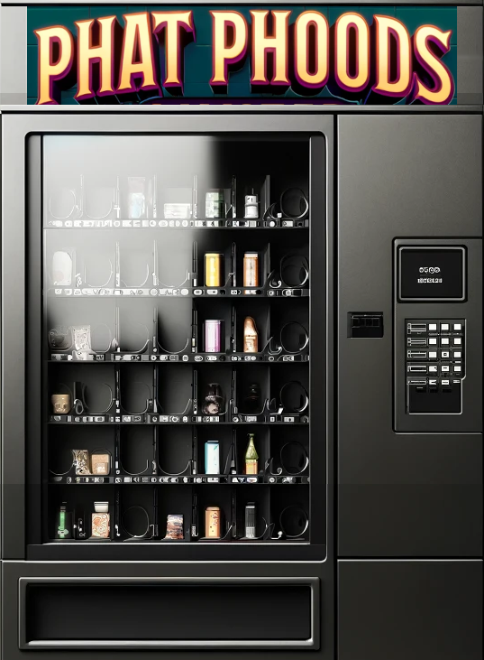
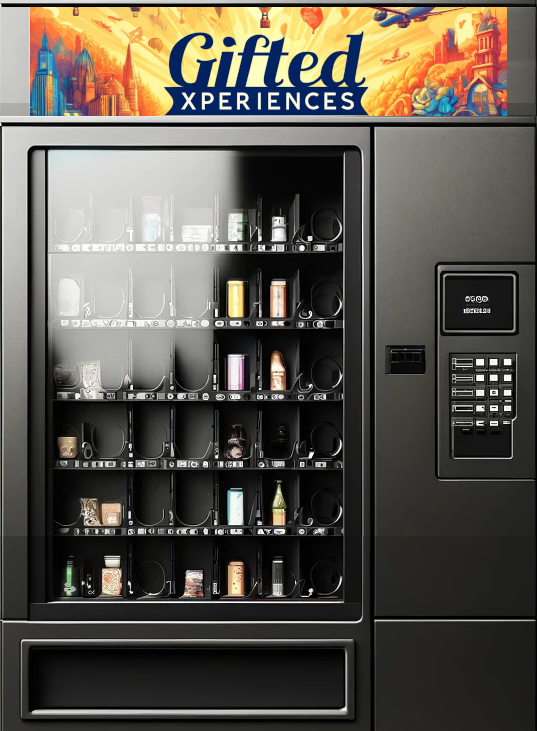
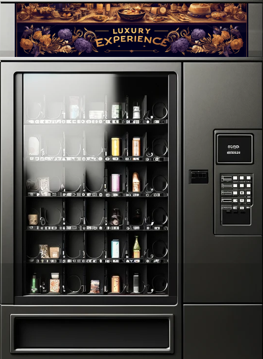
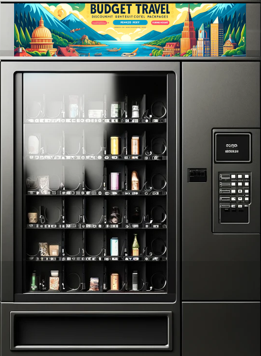
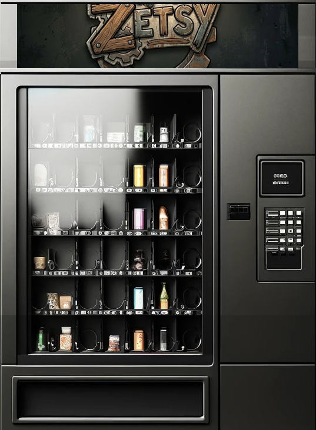
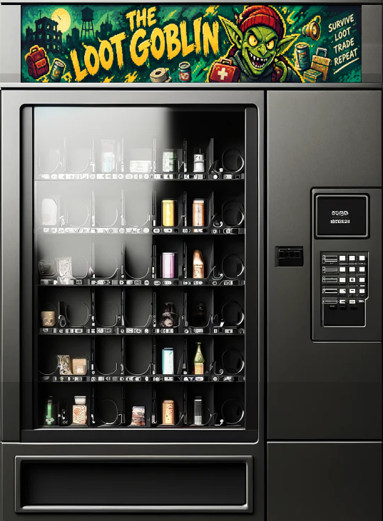
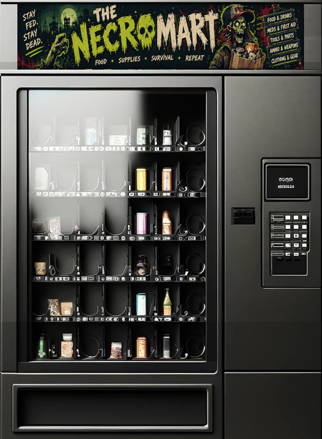
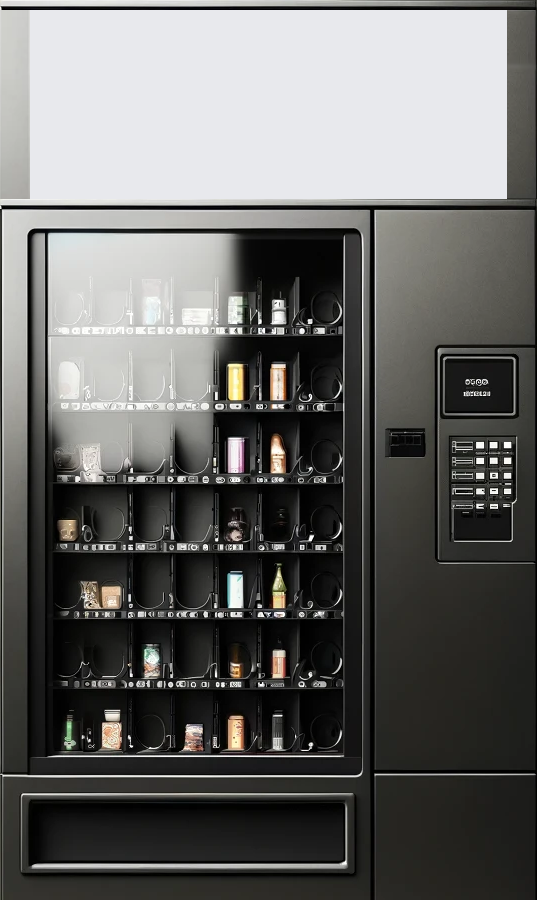
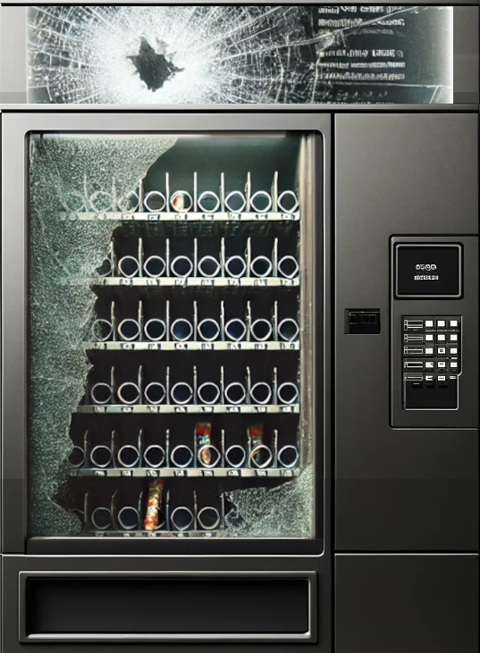

# PhunMart: Machine Art Reference

Every shop needs two pieces of art: a block of **tiles** for the machine in the world, and a
**background** image for the shop window. PhunMart ships more of both than its default shops
use. This page lists what is spare, so a new shop can look like a real machine without anyone
having to draw one.

For how a shop uses these fields, see [Shops](CUSTOMISATION.md#10-shops) in the customisation
guide. For a shop added from another mod, see [A machine of your own](GUIDE_EXTENDING.md#a-machine-of-your-own).

---

## How a machine's tiles are laid out

PhunMart's tiles live in three sheets, `phunmart_01`, `phunmart_02` and `phunmart_03`, each
8 x 8, so tiles are numbered `0` to `63`. You can see the sheets themselves in
[images/phunmart_01.png](images/phunmart_01.png), [images/phunmart_02.png](images/phunmart_02.png)
and [images/phunmart_03.png](images/phunmart_03.png).

Every machine is a block of eight tiles in a row:

| Offset | Used for                 | Facing |
| ------ | ------------------------ | ------ |
| `+0`   | `sprites[1]`             | East   |
| `+1`   | `sprites[2]`             | South  |
| `+2`   | `sprites[3]`             | West   |
| `+3`   | `sprites[4]`             | North  |
| `+4`   | `unpoweredSprites[1]`    | East   |
| `+5`   | `unpoweredSprites[2]`    | South  |
| `+6`   | `unpoweredSprites[3]`    | West   |
| `+7`   | `unpoweredSprites[4]`    | North  |

So a block is fully described by its first tile. The block starting at `phunmart_03_48` is:

```json
"sprites":          ["phunmart_03_48", "phunmart_03_49", "phunmart_03_50", "phunmart_03_51"],
"unpoweredSprites": ["phunmart_03_52", "phunmart_03_53", "phunmart_03_54", "phunmart_03_55"]
```

The order is East, South, West, North, not the compass order you might expect. The unpowered
tiles are only drawn when the shop sets `"powered": true` and the power is off.

---

## Unused tile blocks

None of the default shops use these. They all work as machines today: the tile properties
(vending machine, movable, solid, scrap) are already set.

| First tile       | Full range                | Tile name         | Background                | In the wizard        |
| ---------------- | ------------------------- | ----------------- | ------------------------- | -------------------- |
| `phunmart_01_0`  | `phunmart_01_0` to `_7`   | Vending (generic) | none, see below           | Generic machine      |
| `phunmart_01_16` | `phunmart_01_16` to `_23` | PhatPhoods        | `machine-phat-phoods.png` | Unused machine art 2 |
| `phunmart_02_48` | `phunmart_02_48` to `_55` | GiftedXPerience   | `machine-gifted-xp.png`   | Unused machine art 3 |
| `phunmart_02_56` | `phunmart_02_56` to `_63` | LuxuryXPerience   | `machine-luxury-xp.png`   | Unused machine art 4 |
| `phunmart_03_16` | `phunmart_03_16` to `_23` | Travellers        | `machine-travellers.png`  | Unused machine art 5 |
| `phunmart_03_40` | `phunmart_03_40` to `_47` | Zetsy             | `machine-zetsy.png`       | Unused machine art 6 |
| `phunmart_03_48` | `phunmart_03_48` to `_55` | LootGoblin        | `machine-lootgoblin.png`  | Unused machine art 7 |
| `phunmart_03_56` | `phunmart_03_56` to `_63` | NecroMart         | `machine-necromart.png`   | Unused machine art 8 |

"Tile name" is the `CustomName` in the tile definitions, which is the name the game shows for
the object. It is only a hint at what the art was drawn for; a shop can put any stock behind
any block.

The **Create a shop** wizard on the Tools tab offers these blocks under **Appearance** by the
labels in the last column, followed by every existing shop's tiles if you would rather copy one.

The generic machine has no themed background of its own. Pair it with `machine-none.png` or
`machine-broken.png` from the next section.

---

## Unused backgrounds

Backgrounds are ordinary PNGs in `media/textures/`. A shop names one by file name alone, with
no path: `"background": "machine-zetsy.png"`.

Each themed tile block above has a background drawn to match it, all 537 x 731. Two more are
not tied to any tile block:

| File                 | Size      | Notes                                                                                      |
| -------------------- | --------- | ------------------------------------------------------------------------------------------ |
| `machine-none.png`   | 537 x 900 | A plain machine with a blank sign. The shop window falls back to it when a shop has no background. Taller than the others, so the layout sits slightly differently on it. |
| `machine-broken.png` | 537 x 731 | The same machine with its glass and sign smashed and the shelves almost empty.              |

<p>
  
  
  
  
  
  
  
  
  
</p>

The wizard's **Background** list only shows images some shop already uses. To pick one of
these, choose the last entry and type the file name.

### A new background

Match the shipped size of **537 x 731**. The shop window lays its panels out as percentages of
that shape (measured against `machine-hard-wear.png`), so an image with different proportions
will be stretched and the panels will not line up with the art.

---

## Backgrounds already in use

For reference, so you can see which art goes with which shop:

| Shop                | Tiles start at   | Background                        |
| ------------------- | ---------------- | --------------------------------- |
| `GoodPhoods`        | `phunmart_01_8`  | `machine-good-phoods.png`         |
| `PittyTheTool`      | `phunmart_01_24` | `machine-pity-the-tool.png`       |
| `FinalAmendment`    | `phunmart_01_32` | `machine-final-amendment.png`     |
| `WrentAWreck`       | `phunmart_01_40` | `machine-wrent-a-wreck.png`       |
| `MichellesCrafts`   | `phunmart_01_48` | `machine-michelles.png`           |
| `CarAParts`         | `phunmart_01_56` | `machine-car-a-part.png`          |
| `TraiterJoes`       | `phunmart_02_0`  | `machine-traiter-joes.png`        |
| `CSVPharmacy`       | `phunmart_02_8`  | `machine-csv.png`                 |
| `RadioHacks`        | `phunmart_02_16` | `machine-electronics.png`         |
| `Phish4U`           | `phunmart_02_24` | `machine-phish4u.png`             |
| `HoesNMoes`         | `phunmart_02_32` | `machine-hoes.png`                |
| `BudgetXPerience`   | `phunmart_02_40` | `machine-budget-xp.png`           |
| `HardWear`          | `phunmart_03_0`  | `machine-hard-wear.png`           |
| `Collectors`        | `phunmart_03_8`  | `machine-collectors.png`          |
| `ShedsAndCommoners` | `phunmart_03_24` | `machine-sheds-and-commoners.png` |
| `PrawnStars`        | `phunmart_03_32` | `machine-prawn-stars.png`         |

---

## Using PhunMart's art from another mod

Sprite names are global once a tile pack loads, so another mod *can* point a shop at
`phunmart_03_16` and it will draw. It is better to ship your own pack: otherwise your machine's
art comes from a repository you do not own, and the two mods have to be versioned together
whenever a sprite changes. See [A machine of your own](GUIDE_EXTENDING.md#a-machine-of-your-own).

Backgrounds are different: `media/textures/` merges across mods, so a mod can ship its own
`machine-yourshop.png` without a pack.
