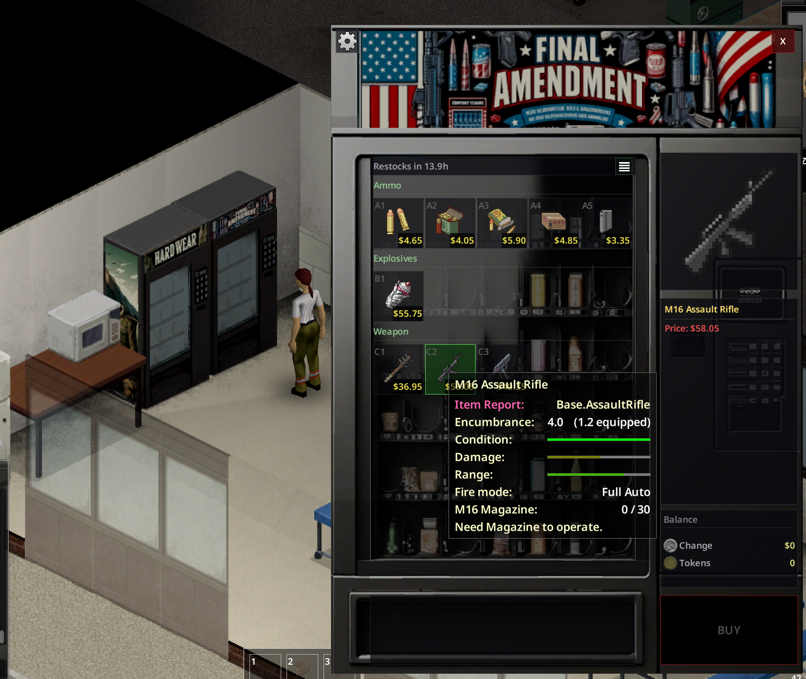

# PhunMart

A Project Zomboid (B42) mod that adds 15 themed automated shops to the world - dispensing food, gear, weapons,
vehicles, skill books, and things you won't find anywhere else. **Traits. XP boosts. Vehicles
delivered to order.** Stock rotates. Coins come from scavenging. Tokens come from surviving or trading rare items.

Shops source from the game's item catalogue by category, so even **modded items can show up
automatically** - if a mod adds something to the Tool or Clothing category, it's eligible for
the relevant machine. No config needed.

> **Requires:** Project Zomboid Build 42.15+ (multiplayer or singleplayer)
> **Optional:** [PhunZones](https://github.com/PhunZoider/PhunZones) — enables zone-difficulty filtering on shop pools

---

## What is it?

When the server starts, PhunMart scans the world and probabilistically converts vanilla vending
machines into one of 15 themed shop types. Each shop has its own sprite, background art, and
loot pool. Stock rotates on a configurable timer. Rarer shop types spawn less frequently and
keep a minimum distance from each other.

Players interact with machines by right-clicking — their character walks up, the machine
connects to the server, and a custom shop UI opens. Items are purchased with **change** (coins
found in the world) or **tokens** (earned through play milestones and the Collectors machine).

Server admins can also place machines manually (by grabbing them from the admin Item List via
the admin menu) and configure every aspect of the system through override Lua files.

---

## Screenshots

---

## The Shops

| Shop                  | Category      | Rarity | What's inside                                                                                       |
| --------------------- | ------------- | ------ | --------------------------------------------------------------------------------------------------- |
| **GoodPhoods**        | Food          | Common | Fresh produce, packaged food, and cooking gear. Cheap, cheerful, and always stocked.                |
| **PittyTheTool**      | Tools         | Common | Hand tools, utility gear, and the odd weapon-adjacent implement.                                    |
| **MichellesCrafts**   | Crafts        | Common | Sewing kits, thread, needles, and assorted craft supplies for the fashion-conscious survivor.       |
| **CarAParts**         | Vehicle Parts | Common | Mechanical spares, fluids, and components to keep your ride alive.                                  |
| **CSVPharmacy**       | Medical       | Common | Bandages and basics up front; antibiotics and rare pharmaceuticals at the back.                     |
| **RadioHacks**        | Electronics   | Common | Walkie-talkies, batteries, circuitry — if it runs on volts, it's probably here.                     |
| **Phish4U**           | Fishing       | Common | Rods, tackle, lures, and bait. Someone kept this thing restocked.                                   |
| **HoesNMoes**         | Gardening     | Common | Seeds, fertiliser, farming tools. Plan for next season.                                             |
| **HardWear**          | Clothing      | Common | Civilian clothing at standard weight; military and protective gear at lower odds.                   |
| **ShedsAndCommoners** | Literature    | Common | All 125 skill books across 25 B42 skills, sorted by volume tier.                                    |
| **FinalAmendment**   | Weapons       | Rare   | Firearms, ammunition, and explosives. Rare, spread out, and worth hunting down.                     |
| **WrentAWreck**       | Vehicles      | Rare   | Order a car. It spawns nearby. Budget, standard, and premium tiers. Restocks weekly.                |
| **TraiterJoes**       | Traits        | Rare   | Spend tokens to gain positive traits or remove negative ones. The rarest machine in the world.      |
| **BudgetXPerience**   | XP / Boosts   | Rare   | Direct skill XP grants and temporary XP multipliers, tiered by power.                               |
| **Collectors**        | Trade-in      | Rare   | Bring your mementos and collectibles. Trade them in for bound tokens. The more obscure, the better. |

**Common** shops have a 15-in-15 base probability weight and no minimum spacing.
**Rare** shops have lower probability weights (5–8) and a minimum tile distance (300–500 tiles)
from other machines of the same type.

---

## Currency

PhunMart uses two separate wallets:

### Change (loose coin)

- Found as loot throughout the world — **Nickel** (5¢), **Dime** (10¢), **Quarter** (25¢)
- Stored as a cents balance (integer). Cap: **$99.99** by default (configurable)
- Used for everyday purchases: food, tools, medical, clothing, books
- On death, the player drops a wallet containing their coins that only they can pick up
  (configurable return rate via sandbox settings)

### Tokens (bound)

- **Not found as loot** — earned only through milestones and the Collectors machine
- Bound to the account — survive character death
- Cap: **60 tokens** by default (configurable)
- Used for high-value purchases, specifically traits

The wallet balance is shown in the shop UI so players always know what they can afford.
Machines that require tokens display the current balance alongside the requirement.

---

## Earning Tokens

Tokens are earned two ways:

### One-time milestones

Awarded automatically when thresholds are crossed — no player action required.

| Milestone                    | Reward              |
| ---------------------------- | ------------------- |
| Playtime: first hour online  | Tokens              |
| Playtime: 5 hours, 10 hours  | Tokens (increasing) |
| Zombie kills: 100, 500, 1000 | Tokens (increasing) |
| Sprinter kills: 50, 200      | Tokens              |

Exact amounts are configurable — see [Customisation Guide](Docs/CUSTOMISATION.md#11-token-rewards).

### Collectors machine (repeatable)

Bring collectible items (toys, antiques, mementos) and trade them in for bound tokens.
Items are sorted into four tiers based on natural spawn rarity:

| Tier      | Examples                                        | Payout              |
| --------- | ----------------------------------------------- | ------------------- |
| Junk      | Common toys, games (weight >100 in loot tables) | 1 token per 3 items |
| Curios    | Antiques, gemstones (weight 5–100)              | 1 token per 2 items |
| Rare      | Scarce naturally-spawning items (weight <5)     | 2 tokens per item   |
| Legendary | Near-zero / event-only drops                    | 3 tokens per item   |

The pool rolls a few items each restock, so the selection changes regularly.

---

## Server Setup

### Installation

1. Subscribe on Steam Workshop (or install manually into `mods/`)
2. Enable **PhunMart2** in your server mod list
3. Start the server — machines will convert automatically on first load

### Sandbox Options

Key settings available in `sandbox-options.txt` or the server sandbox editor:

| Option                  | Default        | Description                                                                                      |
| ----------------------- | -------------- | ------------------------------------------------------------------------------------------------ |
| `ChanceToConvert`       | 80%            | Global % chance to convert a vanilla vending machine                                             |
| `DefaultDistance`       | 200 tiles      | Default minimum tile gap between any two machines                                                |
| `ChangeCapCents`        | 9999 (=$99.99) | Maximum change balance per player                                                                |
| `TokenCap`              | 60             | Maximum token balance per player                                                                 |
| `DropOnDeath`           | true           | Whether the player drops a wallet item on death                                                  |
| `OnlyPickupOwn`         | true           | Whether only the owner can pick up their dropped wallet                                          |
| `ReturnRate`            | 100            | % of change returned in the dropped wallet (100 = full, 0 = nothing)                             |
| `DefaultHoursToRestock` | 72             | Default in-game hours between shop restocks (3 days); per-shop `restockFrequency` overrides this |

### Admin Commands

- `/dumppz all` — dumps perks, traits, items, vehicles to a Lua file for reference
- `/dumppz perks` / `traits` / `items` / `vehicles` — individual dumps

Admins can also place machines manually via the in-game Items List.

### Optional: PhunZones integration

If [PhunZones](https://github.com/PhunZoider/PhunZones) is installed, shop pools can be
filtered by zone difficulty (1–5). For example, the WrentAWreck budget pool appears only in
difficulty 1–2 zones, and the premium pool only in 4–5. Shops in unzoned areas remain
permissive and show all pools.

---

## Customisation

Everything is data-driven and overridable without touching the mod. Drop override files into
your server's `Zomboid/Lua/` folder to patch prices, pools, shops, conditions, and token reward
milestones on top of the built-in defaults.

Full reference with worked examples: **[Docs/CUSTOMISATION.md](Docs/CUSTOMISATION.md)**

Topics covered:

- How prices, rewards, conditions, groups, pools, and shops fit together
- Step-by-step walkthrough: building a new shop from scratch
- How deep-merge overrides work
- All condition tests and their arguments
- All reward kinds (item, trait, skill, boost, vehicle)
- Token reward milestone format

---

## Compatibility

- **Build 42** only — not compatible with B41
- Works in **singleplayer and multiplayer**
- **Mod-compatible by design** — item shops that source by category automatically include
  items added by other mods in those categories, no config changes needed
- No known conflicts; please report issues on [GitHub](https://github.com/PhunZoider/PhunMart/issues)

---

## Links

- [GitHub Repository](https://github.com/PhunZoider/PhunMart)
- [Customisation Guide](Docs/CUSTOMISATION.md)
- [Issue Tracker](https://github.com/PhunZoider/PhunMart/issues)
