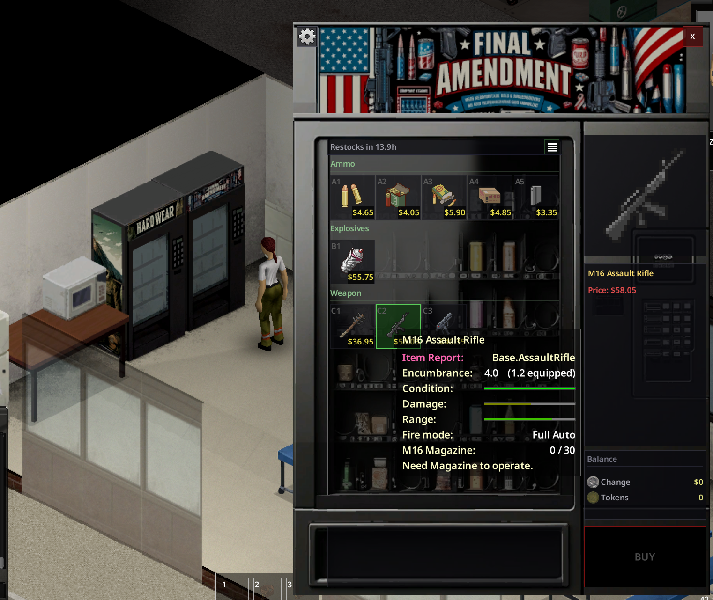

# PhunMart

A Project Zomboid (B42) mod that converts vanilla vending machines into 16 themed automated
shops, dispensing food, gear, weapons, vehicles, livestock, skill books, traits, XP boosts, and more.
Stock rotates on a timer. Coins come from scavenging. Tokens come from surviving.

Shops source from the game's item catalogue by category, so **modded items show up
automatically**, no config needed. Right-click a machine, browse the shop UI, and buy with
**change** (coins found as loot) or **tokens** (earned through milestones and trade-ins).
Admins can place machines manually and override every aspect of the system through Lua files.

> **Requires:** Project Zomboid Build 42 (singleplayer or multiplayer)
> **Optional:** [PhunZones](https://github.com/PhunZoider/PhunZones) for zone-difficulty filtering on shop pools

---

## The Shops

| Shop                  | Category      | Rarity | What's inside                                                                                       |
| --------------------- | ------------- | ------ | --------------------------------------------------------------------------------------------------- |
| **GoodPhoods**        | Food          | Common | Fresh produce, packaged food, and cooking gear. Cheap, cheerful, and always stocked.                |
| **PittyTheTool**      | Tools         | Common | Hand tools, utility gear, and the odd weapon-adjacent implement.                                    |
| **MichellesCrafts**   | Crafts        | Common | Sewing kits, thread, needles, and assorted craft supplies for the fashion-conscious survivor.       |
| **CarAParts**         | Vehicle Parts | Common | Mechanical spares, fluids, and components to keep your ride alive.                                  |
| **CSVPharmacy**       | Medical       | Common | Bandages and basics up front; antibiotics and rare pharmaceuticals at the back.                     |
| **RadioHacks**        | Electronics   | Common | Walkie-talkies, batteries, circuitry. If it runs on volts, it's probably here.                     |
| **Phish4U**           | Fishing       | Common | Rods, tackle, lures, and bait. Someone kept this thing restocked.                                   |
| **HoesNMoes**         | Gardening     | Common | Seeds, fertiliser, farming tools, trapping gear, and live chickens, cows and sheep.                 |
| **HardWear**          | Clothing      | Common | Civilian clothing at standard weight; military and protective gear at lower odds.                   |
| **ShedsAndCommoners** | Literature    | Common | All 125 skill books across 25 B42 skills, sorted by volume tier.                                    |
| **FinalAmendment**    | Weapons       | Rare   | Firearms, ammunition, and explosives. Rare, spread out, and worth hunting down.                     |
| **WrentAWreck**       | Vehicles      | Rare   | Buy a claim key, summon the car when you want it. Budget to premium tiers. Restocks weekly.        |
| **TraiterJoes**       | Traits        | Rare   | Spend tokens to gain positive traits or remove negative ones. One of the rarest machines going.    |
| **BudgetXPerience**   | XP / Boosts   | Rare   | Direct skill XP grants and XP boost levels, tiered by power.                                        |
| **Collectors**        | Trade-in      | Rare   | Bring your mementos and collectibles. Trade them in for bound tokens. The more obscure, the better. |
| **PrawnStars**        | Pawn          | Rare   | Sell jewellery and valuables for change. Five payout tiers from budget ($1) to jackpot ($50).       |

When a vending machine converts, the shop it becomes is drawn at random from the eligible
types, each weighted by its `probability`. **Common** shops carry a weight of 15 and no
minimum spacing. **Rare** shops carry 5 to 8, so they come up roughly a third as often, and
each declares a minimum tile distance (300 to 500) that keeps it away from other machines of
the same type or category.

---

## Currency

PhunMart uses two separate wallets:

### Change (loose coin)

- Found as loot throughout the world: **Nickel** (5¢), **Dime** (10¢), **Quarter** (25¢)
- Stored as a cents balance (integer). Cap: **$99.99** by default (configurable)
- Used for everyday purchases: food, tools, medical, clothing, books
- On death, the player drops a wallet containing their coins that only they can pick up
  (configurable return rate via sandbox settings)

### Tokens (bound)

- **Not found as loot**. Earned only through milestones and the Collectors machine
- Bound to the account, so they survive character death
- Cap: **60 tokens** by default (configurable)
- Used for high-value purchases, specifically traits

The wallet balance is shown in the shop UI so players always know what they can afford.
Machines that require tokens display the current balance alongside the requirement.

---

## Earning Tokens

Tokens are earned two ways:

### One-time milestones

Awarded automatically when thresholds are crossed, with no player action required.

| Milestone                    | Reward              |
| ---------------------------- | ------------------- |
| Playtime: first hour online  | Tokens              |
| Playtime: 5 hours, 10 hours  | Tokens (increasing) |
| Zombie kills: 100, 500, 1000 | Tokens (increasing) |
| Sprinter kills: 50, 200      | Tokens              |

Exact amounts are configurable. See [Customisation Guide](Docs/CUSTOMISATION.md#11-token-rewards) (player rewards).

### Collectors machine (repeatable)

Bring collectible items (toys, antiques, mementos) to a Collectors machine and trade them in
for bound tokens. Rarer items pay more, from 1 token per 3 common items up to 3 tokens for
a legendary find. The selection rotates each restock.

---

## Server Setup

### Installation

1. Subscribe on Steam Workshop (or install manually into `mods/`)
2. Enable **PhunMart2** in your server mod list
3. Start the server and machines will convert automatically on first load

### Sandbox Options

All settings live on the **PhunMart** page of the server sandbox editor, or under
`PhunMart.*` in `sandbox-options.txt`.

**Machine placement**

| Option                  | Default   | Description                                                                                      |
| ----------------------- | --------- | ------------------------------------------------------------------------------------------------ |
| `ChanceToConvert`       | 80        | Percent chance to convert any given vanilla vending machine                                      |
| `DefaultDistance`       | 200       | Default minimum tile gap between two machines of the same type or category                       |
| `DefaultHoursToRestock` | 72        | In-game hours between shop restocks (3 days); a shop's own `restockFrequency` overrides this     |
| `DefaultNumOfHoursToReRoll` | 0     | In-game hours before a machine becomes a different shop. 0 means machines never change.          |
| `DefaultNumOfItemsWhenRestocking` | 5 | Items stocked by a shop that sets no roll count. The low end of a range, so 5 gives 5 to 8.     |
| `MaxStickyItems`        | 10        | Size at which the compiler warns that an always-available pool has grown too big                 |

**Wallets**

| Option               | Default | Description                                                                    |
| -------------------- | ------- | ------------------------------------------------------------------------------ |
| `ChangeCapCents`     | 9999    | Maximum change balance per player, in cents (9999 = $99.99)                    |
| `TokenCap`           | 60      | Maximum token balance per player                                               |
| `EnableChangePool`   | true    | Whether the change wallet exists at all                                        |
| `EnableTokenPool`    | true    | Whether the token wallet exists at all                                         |
| `DropOnDeath`        | true    | Whether the player drops a wallet item on death                                |
| `ReturnRate`         | 100     | Percent of change returned in the dropped wallet (100 = all, 0 = none)         |
| `OnlyPickupOwn`      | true    | Whether only the owner can pick up their death wallet                          |
| `AllowWalletDrop`    | true    | Whether players can drop currency by hand. Deliberate drops are always public. |

**Coin loot**

| Option               | Default | Description                                            |
| -------------------- | ------- | ------------------------------------------------------ |
| `ChanceToDropChange` | 30      | Percent chance a searched container yields loose coins |
| `MinCoinsToDrop`     | 5       | Lowest coin value dropped, in cents                    |
| `MaxCoinsToDrop`     | 75      | Highest coin value dropped, in cents                   |

**Access and diagnostics**

| Option       | Default | Description                                                                                                                             |
| ------------ | ------- | ----------------------------------------------------------------------------------------------------------------------------------------- |
| `EditorRole` | (blank) | Restrict the config editor to admins holding this role name. Blank means every admin may edit. Singleplayer always has access.           |
| `Debug`      | false   | Verbose logging                                                                                                                         |

### Admin Tools

Everything an admin can change lives in one window, **PhunMart Setup**. Open it from the
`** PhunMart **` button on the Admin Panel, or from the Debug Menu. It is a row of tabs
following the chain a shop resolves through:

**Shops** and **Locations** (what shop types exist, and where machines actually stand in the
world) then **Pools**, **Groups**, **Specials**, **Item overrides**, **Prices** and
**Conditions** (what a machine ends up selling, what it charges, and who may buy it) then
**Blacklist**, **Rewards** and **Wallets**.

The last tab, **Tools**, holds the actions that are not edits:

| Tool                    | What it does                                                                        |
| ----------------------- | ------------------------------------------------------------------------------------- |
| Create a shop           | Wizard for a new machine: appearance, spawn rules, and stock                         |
| Change the currency     | Price everything in a lootable item instead of change, with a live preview           |
| Pending restocks        | Machines already placed whose stock predates your edits                              |
| Reset player data       | Clear wallets, purchase history and reward tracking, chosen per tracker              |
| Restock every machine   | Reroll the stock of every machine in the world at once                               |
| Reload definitions      | Re-read the override files from disk, for when you have edited them by hand          |

Machines can also be placed by hand from the in-game Items List.

### Admin Commands

- `/dumppz all` dumps perks, traits, categories, items and vehicles to a Lua file for reference
- `/dumppz perks` / `traits` / `categories` / `items` / `vehicles` for individual dumps

### Optional: PhunZones integration

If [PhunZones](https://github.com/PhunZoider/PhunZones) is installed, shop pools can be
gated by zone difficulty, so what a machine stocks depends on where it stands. WrentAWreck is
the clearest example: its budget pool of small cars and vans is limited to difficulty 0 to 2,
the standard tier to 2 and 3, and the luxury tier to difficulty 4 alone. Machines in unzoned
areas stay permissive and draw on every pool.

---

## Customisation

Everything is data-driven and overridable without touching the mod. Drop JSON override files
into your server's `Zomboid/Lua/` folder to patch prices, pools, shops, conditions, and token
rewards on top of the built-in defaults.

> **Upgrading from before B42.20.4?** The override files used to be Lua tables in `.txt`
> files. That build removed `loadstring`, so the game can no longer read them, and the files
> are now `.json`. Your old files are left untouched and the server log names any it cannot
> read. Convert them with the
> [Phun configuration converter](https://phunzoider.github.io/PhunZones/converter/), which runs
> in your browser and uploads nothing. See
> [Converting your old config files](Docs/CUSTOMISATION.md#converting-your-old-config-files).

Full reference: **[Docs/CUSTOMISATION.md](Docs/CUSTOMISATION.md)** covers common admin recipes,
deep-merge rules, condition tests, special kinds, and a complete shop-from-scratch walkthrough.

Two common jobs have guides of their own:

- **[Adding modded vehicles to WrentAWreck](Docs/GUIDE_ADDING_MODDED_VEHICLE.md)**: four clicks
  in the admin UI, with no Lua editing at all if the vehicle mod is loaded.
- **[Using an item as currency](Docs/GUIDE_ITEM_CURRENCY.md)**: charge in `Base.Money` or
  anything else lootable, and rescale every price to match.

For mod authors rather than admins:

- **[Extending PhunMart from another mod](Docs/GUIDE_EXTENDING.md)**: add a machine, a shop
  window mode or an admin tab from a separate mod, with no fork and no edits to PhunMart.
  This is how [Phlea Market](https://github.com/PhunZoider/PhleaMarket) is built.

---

## Compatibility

Build 42 only. Works in singleplayer and multiplayer. Mod-compatible by design: item shops
source by category, so modded items appear automatically. No known conflicts; please
[report issues on GitHub](https://github.com/PhunZoider/PhunMart/issues).

---

## Links

- [GitHub Repository](https://github.com/PhunZoider/PhunMart)
- [Customisation Guide](Docs/CUSTOMISATION.md)
- [Adding Modded Vehicles](Docs/GUIDE_ADDING_MODDED_VEHICLE.md)
- [Using an Item as Currency](Docs/GUIDE_ITEM_CURRENCY.md)
- [Issue Tracker](https://github.com/PhunZoider/PhunMart/issues)
